# Entity Resolution Maturity Journey

[](LICENSE)
[](https://jepstar990.github.io/entity-resolution-maturity-journey/)

A documented 15-phase maturity model for building enterprise-grade entity resolution and master data management pipelines on **Python + PySpark + Microsoft Fabric**.

```mermaid
flowchart LR
    subgraph Bronze["Bronze Layer"]
        direction LR
        P1["Phase 1\nIngestion"]
        P2["Phase 2\nSchema Validation"]
        P3["Phase 3\nData Quality"]
    end

    subgraph Silver["Silver Layer"]
        direction LR
        P4["Phase 4\nStandardization"]
        P5["Phase 5\nEnrichment"]
        P6["Phase 6\nExact Dedup"]
        P7["Phase 7\nFuzzy Matching"]
        P8["Phase 8\nBlocking"]
    end

    subgraph Gold["Gold Layer"]
        direction LR
        P9["Phase 9\nFeature Engineering"]
        P10["Phase 10\nML Matching"]
        P11["Phase 11\nLLM Semantic"]
        P12["Phase 12\nEmbeddings"]
        P13["Phase 13\nGolden Record"]
        P14["Phase 14\nStewardship"]
        P15["Phase 15\nMDM"]
    end

    P1 --> P2 --> P3 --> P4 --> P5 --> P6 --> P7 --> P8 --> P9 --> P10 --> P11 --> P12 --> P13 --> P14 --> P15

    style Bronze fill:#cd7f32,color:#fff
    style Silver fill:#a8a8a8,color:#fff
    style Gold fill:#ffd700,color:#000
```



## The Maturity Model

| Phase | Name | Input State | Output State | Key Technology |
|-------|------|-------------|--------------|----------------|
| 1 | Basic Data Ingestion | Source Systems | Bronze Tables | PySpark, Delta Lake |
| 2 | Schema Validation | Bronze | Validated Bronze | Schema Registry, PySpark |
| 3 | Data Quality Rules | Validated Bronze | Silver | Great Expectations |
| 4 | Standardization | Silver | Silver Standardized | PySpark UDFs, Regex |
| 5 | Data Enrichment | Silver Standardized | Enriched Silver | Reference Data APIs |
| 6 | Exact Deduplication | Enriched Silver | Deduplicated Silver | Window Functions |
| 7 | Fuzzy Matching | Deduplicated Silver | Candidate Matches | Levenshtein, Jaro-Winkler |
| 8 | Record Blocking | Deduplicated Silver | Blocked Candidates | Sorted Neighborhood |
| 9 | Feature Engineering | Candidate Pairs | Feature Vectors | PySpark ML |
| 10 | Probabilistic Matching | Feature Vectors | Match Probabilities | XGBoost, scikit-learn |
| 11 | LLM Semantic Matching | Low-Confidence Pairs | Semantic Scores | LLM APIs, LangChain |
| 12 | Embedding-Based Matching | Golden Candidates | Vector Matches | FAISS, Sentence Transformers |
| 13 | Golden Record Creation | Matched Records | Golden Records | Survivorship Rules |
| 14 | Data Stewardship | Uncertain Matches | Reviewed Decisions | Review Queue, Feedback Loop |
| 15 | MDM Distribution | Golden Records | Enterprise Consumption | REST API, Event Streams |

## Who Is This For?

- **Data Engineers** — Build reliable ingestion, validation, and quality pipelines (Phases 1-8, 13-15)
- **ML Engineers** — Design and train matching models from exact to embeddings (Phases 6-12)
- **Data Stewards** — Manage review queues and survivorship rules (Phases 3, 13-14)
- **Architects** — Design enterprise MDM systems with proven patterns (Full journey)

## Quick Start

```bash
# Clone the repo
git clone https://github.com/JepStar990/entity-resolution-maturity-journey.git
cd entity-resolution-maturity-journey

# Install docs dependencies
pip install -r requirements-docs.txt

# Serve documentation locally
mkdocs serve
```

Visit `http://127.0.0.1:8000` to browse the full documentation.

## Repository Structure

```
entity-resolution-maturity-journey/
├── docs/
│   ├── index.md                    # Landing page
│   ├── architecture.md             # System context & data flow
│   ├── getting-started.md          # Prerequisites & reading paths
│   ├── phases/                     # 15 phase documentation files
│   │   ├── overview.md             # Summary table & maturity curve
│   │   └── phase-01 through 15     # Detailed per-phase docs
│   ├── diagrams/                   # Mermaid source files (.mmd)
│   │   ├── master-pipeline.mmd
│   │   ├── data-flow-architecture.mmd
│   │   └── phase-01 through 15.mmd
│   └── reference/                  # Glossary, tech stack, bibliography
├── examples/                       # Annotated PySpark code scaffolding
│   ├── src/                        # Python modules per phase
│   ├── config/                     # YAML config stubs
│   └── notebooks/                  # Jupyter notebooks per phase
├── mkdocs.yml                      # MkDocs + Material configuration
└── requirements-docs.txt           # Python dependencies
```

## License

Apache 2.0 — see [LICENSE](LICENSE) for details.
