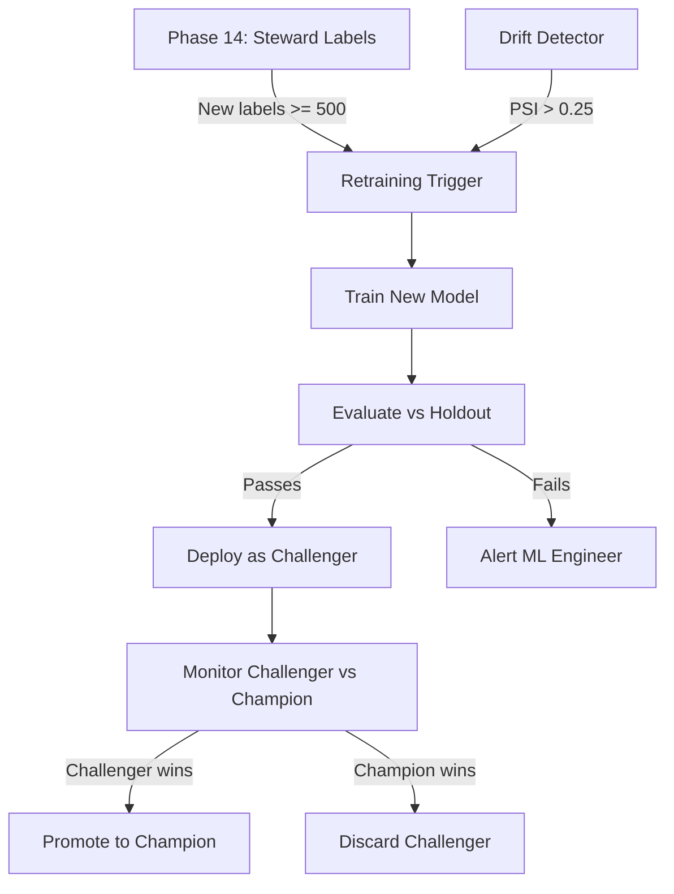

# Feature Roadmap

This document catalogs the planned capabilities that extend the reference scaffolding into a production-grade, fully automated entity resolution platform. Each entry describes the current state, the target state, the implementation approach, dependencies, and the maturity phase it impacts.

---

## Overview

The 15-phase reference implementation provides annotated, config-driven scaffolding for each phase of the entity resolution maturity journey. It demonstrates the *pattern* — ingestion, validation, quality, standardization, enrichment, matching, golden record creation, stewardship, and distribution. However, it deliberately leaves certain concerns to the implementer: orchestration, incremental processing, state management, model lifecycle, multi-tenancy, real-time operation, data lineage, error recovery, performance tuning, LLM hardening, and vector database lifecycle management.

This roadmap defines the target state for each of these gaps. Each feature is scoped so that it can be implemented independently, but dependencies between features are noted where they exist.

---

## Feature 1: Orchestration Runtime

### Current State

Each phase module exposes a `run(spark, df, config, ...) -> DataFrame` function. The modules are designed to be composed sequentially, but there is no built-in mechanism to execute them in order, handle failures, retry, or observe pipeline health. The `00-master-orchestrator.ipynb` notebook demonstrates sequential invocation in a Fabric notebook environment, but it is a linear script with no error handling or scheduling capability.

### Target State

A production-grade orchestration layer that:

- **Schedules pipeline runs** on a cron or event-driven basis (file arrival in OneLake, webhook from source system, manual trigger).
- **Manages DAG dependencies** — Phase 3 cannot run until Phase 2 completes for the same batch; Phase 10 model training cannot run until steward labels reach a minimum threshold.
- **Retries with exponential backoff** — transient failures (network blip to JDBC source, Spark cluster resource contention) are retried automatically with configurable backoff.
- **Alerts on failure** — integration with PagerDuty, Opsgenie, email, or Microsoft Teams when a phase fails after all retries are exhausted.
- **Passes context between phases** — batch ID, source system, entity type, and run metadata flow automatically from phase to phase without manual wiring.
- **Supports backfill** — re-run the pipeline for a historical date range without manual script modification.
- **Integrates natively with Microsoft Fabric** — uses Fabric Data Pipelines for scheduling and Fabric Data Activator for alerting, while remaining portable to Airflow or Dagster for non-Fabric deployments.

### Implementation Approach

| Component | Technology (Fabric) | Technology (Portable) |
|-----------|---------------------|----------------------|
| Scheduling | Fabric Data Pipelines | Apache Airflow 2.9+ / Dagster 1.8+ |
| DAG definition | Notebook activity chaining | Python DAG files |
| Retry logic | Pipeline retry policy | Airflow `retries` + `retry_delay` |
| Alerting | Fabric Data Activator (Reflex) | Airflow callbacks → PagerDuty/Slack |
| Parameter passing | Pipeline parameters + Lakehouse file | Airflow XCom / Dagster assets |
| Backfill | Pipeline run with date range param | Airflow `backfill` / Dagster backfill |

### Phases Impacted

All 15 phases. Orchestration is the connective tissue between every phase.

### Dependencies

None — orchestration can be added without modifying any phase module code. The `run()` contract is the integration point.

---

## Feature 2: Incremental Processing and Change Data Capture

### Current State

Every `run()` function processes the full dataset. When new records arrive — for example, 10,000 new customers added overnight to a 5-million-record table — the pipeline re-processes all 5,010,000 records. For Phases 1-5 (ingestion through enrichment), this may be acceptable. For Phases 6-12 (matching), it is not — re-comparing all 5 million records against each other on every run is computationally prohibitive.

### Target State

A watermark-based incremental processing system that:

- **Tracks watermarks per source system** — the last `_ingested_at` or source-system timestamp that was successfully processed through each phase.
- **Processes only delta records** — new and updated records since the last watermark are identified and processed in isolation.
- **Incrementally updates match pairs** — new records are compared against existing records within their block (Phase 8), not against the entire dataset. Existing match pairs that have not changed are not re-computed.
- **Handles updates and deletions** — when a source record is updated (e.g., a customer changes their email) or deleted (GDPR erasure), the pipeline detects the change and re-evaluates only the affected entity cluster.
- **Supports CDC from source systems** — integrates with SQL Server CDC, PostgreSQL logical replication, DynamoDB Streams, or Kafka topics for near-real-time delta ingestion.
- **Maintains exactly-once semantics** — watermark commits are atomic with the phase output. If a phase fails mid-processing, the watermark is not advanced, and the next run re-processes the same delta without duplication.

### Implementation Approach

```
Bronze Layer (Phase 1)
  │
  ├── Full snapshot on first run
  └── Subsequent runs: only new _ingested_at > last_watermark

Silver Layer (Phases 2-8)
  │
  ├── Full standardization/enrichment on first run
  └── Subsequent runs: incremental upsert via Delta MERGE

Gold Layer (Phases 9-15)
  │
  ├── New/updated records → generate candidate pairs against existing block members only
  ├── Changed records → invalidate existing match pairs, re-compare
  ├── Deleted records → remove from golden record, re-evaluate cluster
  └── Golden record regenerated only for affected entities
```

### Watermark Table Schema

| Column | Type | Description |
|--------|------|-------------|
| `source_system` | string | Source system identifier |
| `entity_type` | string | Entity type (customer, product, etc.) |
| `phase` | string | Phase that processed this batch |
| `watermark_timestamp` | timestamp | Latest `_ingested_at` processed |
| `batch_id` | string | Batch that advanced this watermark |
| `processed_at` | timestamp | When the watermark was committed |
| `record_count` | long | Number of records in this delta |

### Phases Impacted

All phases. Phases 6-12 benefit most dramatically — incremental matching reduces pairwise comparison volume by 99%+ on typical daily delta volumes.

### Dependencies

- Feature 1 (Orchestration) — watermarks must be managed within the orchestrator's state.
- Delta Lake time travel — watermark queries depend on Delta's ability to query tables as-of a point in time.

---

## Feature 3: State Management Between Runs

### Current State

The pipeline is stateless between invocations. Each `run()` call operates on its inputs and writes its outputs to Delta tables, but there is no persisted pipeline state — no record of which batches have been processed, which quality gates were passed, which match model version produced which pairs, or which steward decisions are pending. Delta Lake provides table-level versioning (time travel), but the pipeline itself has no memory.

### Target State

A dedicated pipeline state store that:

- **Tracks every pipeline run** — run ID, start time, end time, status, input batch IDs, output record counts, and the Spark application ID for debugging.
- **Records phase-level provenance** — for every record in the Gold layer, which phase produced it, which model version was used, which configuration was active, and which steward reviewed it.
- **Persists model lineage** — when Phase 10 produces match probabilities, the state store records: model version, training data snapshot ID, hyperparameters, evaluation metrics, and the MLflow run ID.
- **Enables point-in-time reconstruction** — "Show me the golden customer record for entity X as it existed on 2026-03-15, including which source records contributed and which survivorship rules were applied."
- **Supports pipeline pause/resume** — if the pipeline is stopped mid-run (capacity paused, cluster terminated), it can resume from the last completed phase rather than restarting from Phase 1.
- **Provides an audit API** — compliance and data governance teams can query the state store directly: "Which steward reviewed this entity merge? When? What did they decide and why?"

### State Store Schema

```
pipeline_runs
├── run_id: string (PK)
├── run_type: string (full, incremental, backfill)
├── entity_type: string
├── status: string (running, completed, failed, aborted)
├── start_time: timestamp
├── end_time: timestamp
├── spark_app_id: string
├── triggered_by: string
└── parameters: map<string, string>

phase_executions
├── run_id: string (FK → pipeline_runs)
├── phase: string (e.g., '03-data-quality')
├── status: string
├── input_record_count: long
├── output_record_count: long
├── start_time: timestamp
├── end_time: timestamp
├── config_snapshot: string (JSON of active config)
└── metrics: map<string, double>

record_provenance
├── entity_id: string
├── source_record_id: string
├── source_system: string
├── phase_produced: string
├── run_id: string
├── model_version: string (nullable)
├── steward_id: string (nullable)
└── produced_at: timestamp
```

### Phases Impacted

All phases. Every phase writes a `phase_executions` row on completion. Phases 10-14 write `record_provenance` rows for every record they produce or modify.

### Dependencies

- Feature 1 (Orchestration) — the orchestrator creates the `pipeline_runs` row and passes `run_id` to each phase.
- Delta Lake — the state store itself is stored as Delta tables in a dedicated `audit/` schema.

---

## Feature 4: Automated Model Lifecycle Management

### Current State

Phase 10 (`phase_10_probabilistic_matching.py`) trains an XGBoost model using labeled pairs from configuration or from a provided training DataFrame. The Phase 10 documentation references MLflow for experiment tracking, but the reference code does not:
- Automatically trigger retraining when enough new steward labels have accumulated.
- Detect when a deployed model's performance has degraded (drift).
- A/B test a new model against the current production model.
- Roll back to a previous model version if the new model underperforms.
- Promote a model from staging to production with an approval gate.

### Target State

A closed-loop model lifecycle that:

- **Triggers retraining automatically** — when the number of new steward-labeled pairs (from Phase 14) exceeds a configurable threshold (default: 500 new labels), a retraining job is queued.
- **Evaluates the new model against a holdout set** — the new model must match or exceed the current production model on precision, recall, F1, and a business-weighted cost function before promotion is allowed.
- **Detects drift** — the pipeline monitors the distribution of match scores, feature values, and entity attributes between the training set and live data. When drift exceeds a threshold (Population Stability Index > 0.25 or KL divergence > 0.1), an alert is raised and a retraining job is queued regardless of label count.
- **Supports champion/challenger deployment** — a new model can be deployed as a "challenger" alongside the "champion" production model. Both models score the same pairs, but only the champion's scores are used for matching. After a configurable evaluation period, the challenger is either promoted or discarded.
- **Provides one-click rollback** — model versions are immutable in MLflow. Rolling back is a configuration change (update `model_version` in `pipeline-config.yaml`), not a code deploy.
- **Maintains an audit trail** — every model promotion, rollback, and performance report is logged immutably for regulatory compliance (FDA, SOC 2, SOX).

### Automated Retraining Pipeline



### Model Metadata Schema

```yaml
model_registry:
  production_model:
    model_name: "customer-xgboost-matcher"
    model_version: "v3"
    mlflow_run_id: "a7b3c9d2..."
    deployed_at: "2026-07-15T09:00:00Z"
    metrics:
      precision: 0.97
      recall: 0.94
      f1: 0.955
  challenger_model:
    model_name: "customer-xgboost-matcher"
    model_version: "v4"
    deployed_at: "2026-07-22T09:00:00Z"
    evaluation_end: "2026-08-05T09:00:00Z"
  retraining_policy:
    min_new_labels: 500
    max_model_age_days: 90
    drift_threshold_psi: 0.25
    evaluation_metric: "f1"
    min_improvement: 0.01
```

### Phases Impacted

- Phase 10 (Probabilistic Matching) — model training, evaluation, and deployment.
- Phase 14 (Data Stewardship) — label generation for retraining.
- Phase 15 (MDM Distribution) — model version is exposed to consumers for audit.

### Dependencies

- Feature 3 (State Management) — model provenance and audit trail.
- MLflow — model registry, experiment tracking, and model serving.

---

## Feature 5: Multi-Tenancy and Role-Based Access Control

### Current State

The pipeline operates within a single Fabric workspace with no tenant isolation. All configuration, all data, all quality reports, and all stewardship queues are shared. In a large enterprise, multiple business units (Retail Banking, Wealth Management, Commercial Banking) may need independent entity resolution pipelines with different rules, different stewards, and different access controls — operating on overlapping or disjoint subsets of the same entity types.

### Target State

A multi-tenant architecture that:

- **Isolates configuration per tenant** — each business unit (tenant) has its own `entity-customer.yaml` with tenant-specific matching rules, quality thresholds, and survivorship rules. A shared base configuration provides defaults that tenants can override.
- **Partitions data by tenant** — Bronze/Silver/Gold tables are partitioned (physically or logically) by `tenant_id`. A tenant's queries and pipeline runs never touch another tenant's data.
- **Enforces role-based access control (RBAC)** — at minimum:
    - **Pipeline Operator**: Can trigger runs, view run status, and acknowledge alerts. Cannot view entity data.
    - **Data Steward**: Can view and resolve items in their assigned stewardship queue. Cannot modify pipeline configuration or model parameters. Stewards are assigned to specific tenants.
    - **Data Engineer**: Can modify pipeline configuration, quality rules, and ingestion sources for their assigned tenants. Cannot view or modify steward decisions.
    - **ML Engineer**: Can train models, view model performance, and promote models. Cannot modify pipeline configuration or view steward decisions.
    - **Compliance Officer**: Read-only access to audit logs, model provenance, and stewardship history. Cannot modify any data or configuration.
    - **Administrator**: Full access. Can create tenants, assign roles, and modify global configuration.
- **Supports cross-tenant entity resolution where authorized** — a compliance function may need to resolve entities across all tenants (e.g., AML across all lines of business). Cross-tenant resolution requires explicit authorization and is fully audited.
- **Integrates with enterprise identity providers** — Microsoft Entra ID (Azure AD) for Fabric deployments; LDAP/SAML/OIDC for portable deployments.

### Tenant Configuration Hierarchy

```
pipeline-config.yaml          # Global defaults
├── tenant-retail-banking/
│   ├── tenant-config.yaml     # Tenant-specific overrides
│   ├── entity-customer.yaml   # Customer rules for retail
│   └── entity-product.yaml    # Product rules for retail
├── tenant-wealth-management/
│   ├── tenant-config.yaml
│   └── entity-customer.yaml   # Different matching rules for HNW customers
└── tenant-compliance/
    ├── tenant-config.yaml     # Cross-tenant resolution enabled
    └── entity-counterparty.yaml
```

### RBAC Matrix

| Action | Operator | Steward | Data Engineer | ML Engineer | Compliance | Admin |
|--------|----------|---------|---------------|-------------|------------|-------|
| Trigger pipeline run | Yes | No | Yes | No | No | Yes |
| View run status | Yes | No | Yes | Yes | Yes | Yes |
| Resolve steward items | No | Yes (own tenant) | No | No | No | No |
| Modify quality rules | No | No | Yes (own tenant) | No | No | Yes |
| Modify ingestion sources | No | No | Yes (own tenant) | No | No | Yes |
| Train model | No | No | No | Yes | No | Yes |
| Promote model | No | No | No | Yes (with approval) | No | Yes |
| View entity data | No | Yes (own queue) | No | No | No | Yes |
| View audit logs | No | No | No | No | Yes | Yes |
| Cross-tenant query | No | No | No | No | Yes (with auth) | Yes |

### Phases Impacted

All phases. Tenant context is threaded through every `run()` call.

### Dependencies

- Feature 3 (State Management) — tenant-aware audit logs.
- Microsoft Entra ID or equivalent identity provider.
- Fabric workspace design — one workspace per tenant, or one workspace with tenant-level folder partitioning.

---

## Feature 6: Real-Time and Streaming Matching

### Current State

Phases 6-12 (exact dedup through embedding matching) operate exclusively in batch mode. The pipeline ingests data, processes it through sequential phases, and produces golden records on a scheduled cadence. There is no capability to resolve an entity at the point of data entry — for example, to check "does this customer already exist?" during account opening, or "is this product already in the catalog?" during supplier onboarding.

Phase 1 supports Spark Structured Streaming for ingestion, and Phase 15 provides a FastAPI endpoint for MDM lookup (querying already-resolved golden records). But the matching engine itself is batch-only.

### Target State

A dual-mode architecture where:

- **Batch mode** continues to operate as the primary pipeline for comprehensive, high-accuracy entity resolution on the full dataset.
- **Real-time mode** provides sub-second entity resolution at the point of data entry, using pre-computed indices and embeddings generated by the batch pipeline.

#### Real-Time Ingestion Matching

When a new customer record arrives (e.g., account opening, form submission, API call):

1. **Phase 1 (Streaming)**: Record is ingested, metadata is appended, record is written to Bronze.
2. **Phase 4 (Real-Time Standardization)**: Name, email, phone, and address are standardized inline using the same UDFs as the batch pipeline — deployed as a lightweight service or Spark Structured Streaming UDF.
3. **Phase 6 (Real-Time Exact Match)**: Standardized email and phone are hashed and looked up against a Redis/cache index of existing entity keys. If an exact match exists → entity is resolved immediately.
4. **Phase 12 (Real-Time Embedding Search)**: If no exact match, the record is embedded using the same Sentence Transformer model used in batch Phase 12. The embedding is searched against a FAISS/Milvus index of existing entity embeddings. The top-K candidates with cosine similarity > 0.95 are returned.
5. **Decision**: If a high-confidence match exists, return the existing entity ID. If no match, create a new entity ID and queue the record for batch processing. If ambiguous (0.85-0.95), return a tentative match with a flag for steward review.

#### Real-Time Architecture

```
New Record → Standardize → Exact Lookup → Found? → Return Entity ID
                                │
                                No
                                │
                                v
                          Embed → FAISS Search → High confidence? → Return Entity ID
                                                       │
                                                       No/Ambiguous
                                                       │
                                                       v
                                               Queue for Batch + Flag Steward
```

#### Latency Budget

| Step | Target Latency | Technology |
|------|---------------|------------|
| Standardization | < 10ms | Python UDF (in-process) |
| Exact Lookup | < 5ms | Redis / Azure Cache for Redis |
| Embedding | < 100ms | Sentence Transformers (ONNX-optimized) |
| FAISS Search | < 20ms | FAISS IVFPQ index (pre-loaded in memory) |
| Decision + Response | < 5ms | FastAPI |
| **Total** | **< 200ms** | |

#### Index Freshness

- **Exact match index** (Redis): Updated every 60 seconds from Delta Lake change feed.
- **Embedding index** (FAISS): Rebuilt every 15 minutes from the full golden entity set. Rebuild is non-blocking (new index replaces old index atomically).
- **Staleness SLA**: A newly merged golden record is available for real-time matching within 15 minutes.

### Phases Impacted

- Phase 1: Streaming ingestion path.
- Phase 4: Real-time standardization service.
- Phase 6: Real-time exact match lookup.
- Phase 12: Real-time embedding search with FAISS index serving.
- Phase 15: Real-time MDM API extended to serve both golden record lookup and entity resolution at ingestion time.

### Dependencies

- Feature 2 (Incremental Processing) — the real-time index must be updated incrementally from the batch pipeline's output.
- FAISS or Milvus for vector index serving.
- Redis or equivalent for exact match index.
- ONNX runtime for optimized embedding inference.

---

## Feature 7: Column-Level Data Lineage

### Current State

The pipeline provides basic traceability through metadata columns:
- `_source_system`: Which source system the record came from.
- `_batch_id`: Which ingestion batch.
- `_ingested_at`: When it was ingested.

This is record-level lineage — you can trace a golden record back to its source records. But there is no column-level lineage: you cannot answer "this golden email address — which source record and which survivorship rule selected it?" without manually inspecting the survivorship configuration and the source records.

### Target State

Column-level lineage integrated with enterprise data governance:

- **Every field in a golden record is traceable to its source** — the golden record stores, for each field, a reference to the source record, source system, and the survivorship rule that selected it.
- **Lineage is queryable via API and UI** — "Show me the full lineage of `golden_customers.email` for entity `e7b3f1a2-...`" returns a graph: source records → quality gates passed → standardization applied → matching decisions → survivorship rule → golden value.
- **Lineage integrates with Microsoft Purview** — the pipeline emits lineage metadata to Purview via the Apache Atlas API, enabling cross-system lineage (not just within the entity resolution pipeline, but upstream to source systems and downstream to consumers).
- **Lineage survives schema evolution** — if a source system adds a column, the lineage graph adds a node. If a column is deprecated, the lineage records the deprecation. Historical lineage is preserved immutably.

### Golden Record Schema with Per-Field Provenance

Instead of:

```
golden_customers
├── entity_id: string
├── email: string
└── phone: string
```

The golden record stores:

```
golden_customers
├── entity_id: string
├── email: struct<
│   value: string,
│   source_record_id: string,
│   source_system: string,
│   survivorship_rule: string,
│   selected_at: timestamp
│ >
├── phone: struct<
│   value: string,
│   source_record_ids: array<string>,  # Multiple sources agree
│   source_systems: array<string>,
│   survivorship_rule: string,
│   selected_at: timestamp
│ >
└── _lineage: array<struct<
    source_record_id: string,
    source_system: string,
    phase_entered: string,
    transformations_applied: array<string>,
    quality_score: float
  >>
```

### Lineage Graph API

```
GET /api/v1/lineage/entity/{entity_id}
→ {
    "entity_id": "e7b3f1a2-...",
    "fields": {
      "email": {
        "value": "jsmith@acme.com",
        "sources": [
          {"record_id": "r-crm-001", "system": "CRM", "value": "jsmith@acme.com"},
          {"record_id": "r-ecom-055", "system": "E-Commerce", "value": "JSmith@acme.com"}
        ],
        "survivorship_rule": "most_recent",
        "selected_from": "r-ecom-055"
      }
    },
    "upstream": [...],
    "downstream": ["CRM Sync (2026-08-01)", "Analytics Dashboard"]
  }
```

### Phases Impacted

- Phase 3 (Data Quality): Record quality scores per field, not just per record.
- Phase 4 (Standardization): Track pre-standardization and post-standardization values.
- Phase 13 (Golden Record): Per-field provenance in the golden record schema.
- Phase 15 (MDM Distribution): Lineage API.

### Dependencies

- Feature 3 (State Management) — lineage metadata storage.
- Microsoft Purview or Apache Atlas for cross-system lineage.
- Delta Lake column mapping for schema evolution tracking.

---

## Feature 8: Error Recovery and Dead Letter Queue

### Current State

Phase 3 quarantines records that fail quality rules to a separate table path. But there is no:
- Automated retry for transient failures (e.g., JDBC connection timeout, temporary file unavailability).
- Dead letter queue (DLQ) with replay capability for records that fail after all retries.
- Alerting when a quality gate blocks more than X% of records.
- Circuit breaker that halts the pipeline if failure rates spike, preventing cascading failures.

### Target State

A resilient error handling framework:

- **Per-phase retry policies** — each phase defines its retry behavior:
    - Phase 1 (Ingestion): Retry 3 times with 30s/60s/120s backoff for JDBC connections. No retry for schema mismatch (that requires human intervention).
    - Phase 3 (Quality): No retry (quality failures are data problems, not transient errors).
    - Phase 10 (ML Training): Retry 2 times with 60s backoff for cluster resource issues.
    - Phase 11 (LLM): Retry 5 times with exponential backoff for API rate limiting.
- **Dead Letter Queue** — records that fail processing are written to a DLQ with:
    - The original record (preserved exactly).
    - The phase and step where it failed.
    - The error message and stack trace.
    - The retry count and timestamps.
    - A `status` field: `pending_retry`, `permanent_failure`, `manual_review`, `replayed`.
- **DLQ Replay** — an operator can replay a DLQ record (or a batch of DLQ records) after fixing the root cause (e.g., updating a schema, adding a reference data entry, fixing a source system). Replayed records re-enter the pipeline at the phase where they failed.
- **Circuit Breaker** — if a phase's failure rate exceeds a threshold within a time window, the pipeline halts and alerts. This prevents 500,000 records from piling up in the DLQ because of a silent configuration error.
    - Default thresholds: > 5% failure rate over a 10-minute window → halt. > 20% failure rate → immediate halt.
- **DLQ Monitoring Dashboard** — a Fabric Power BI or Grafana dashboard showing:
    - DLQ depth by phase, entity type, and failure reason.
    - Age of oldest un-replayed record.
    - Replay success rate.
    - Failure rate trend (is it getting better or worse?).

### DLQ Schema

```
dead_letter_queue
├── dlq_id: string (PK)
├── entity_type: string
├── source_system: string
├── phase: string
├── step: string
├── original_record: string (JSON)
├── error_message: string
├── error_type: string (transient, schema, quality, resource, unknown)
├── retry_count: int
├── max_retries: int
├── first_failure_at: timestamp
├── last_retry_at: timestamp
├── status: string
├── resolved_by: string
├── resolved_at: timestamp
└── replay_batch_id: string
```

### Phases Impacted

All phases. Every phase wraps its processing in a standardized error handler that decides: retry, DLQ, or halt.

### Dependencies

- Feature 1 (Orchestration) — retry logic and circuit breaker are orchestration concerns.
- Feature 3 (State Management) — DLQ records are part of pipeline state.

---

## Feature 9: Performance Tuning and Benchmarking Framework

### Current State

The reference code uses default Spark configurations. There is no guidance on:
- Optimal shuffle partition count for different data volumes.
- When to use broadcast joins vs. shuffle joins.
- Delta Lake `OPTIMIZE` and `VACUUM` scheduling.
- Expected throughput and latency at different scales.
- Profiling or bottleneck identification.

### Target State

A performance framework that provides:

- **Tiered sizing recommendations** — five reference architectures with Spark configurations, cluster sizes, and expected throughput:

| Tier | Record Volume | Workers | Executor Memory | Shuffle Partitions | Expected Phase 7 Runtime |
|------|--------------|---------|-----------------|--------------------|-----------------------|
| Dev/Test | < 100K | 2 | 8 GB | 200 | < 30 seconds |
| Small | 100K - 1M | 4 | 16 GB | 400 | < 5 minutes |
| Medium | 1M - 10M | 8 | 32 GB | 800 | < 30 minutes |
| Large | 10M - 100M | 16 | 64 GB | 1600 | < 4 hours |
| Enterprise | > 100M | 32+ | 128 GB | 3200 | < 12 hours |

- **Built-in profiling** — each phase emits Spark metrics (task duration, shuffle read/write, spill to disk, GC time) to the `MetricsCollector`. The metrics are aggregated into a performance report that identifies the bottleneck phase.
- **Benchmarking harness** — a script that generates synthetic entity data at configurable volumes (10K to 100M records) with configurable duplication rates (5-40%) and runs the full pipeline, producing a benchmark report: time per phase, throughput (records/second), and cost estimate (Fabric CU-seconds or Databricks DBU-hours).
- **Auto-tuning recommendations** — after a benchmark run, the framework suggests configuration changes: "Phase 7 fuzzy matching spilled 12 GB to disk. Increase `spark.sql.shuffle.partitions` from 200 to 800 or increase executor memory from 8 GB to 16 GB."
- **Delta Lake maintenance automation** — a scheduled maintenance job that:
    - Runs `OPTIMIZE` on Bronze tables weekly, Silver tables daily, Gold tables after each merge.
    - Runs `VACUUM` with configurable retention (default: 7 days).
    - Purges old table versions beyond the retention window.

### Benchmark Report Schema

```yaml
benchmark_run:
  run_id: "bench-2026-08-09-001"
  data_profile:
    total_records: 5000000
    entity_type: customer
    duplicate_rate_pct: 12.3
    avg_fields_per_record: 15
  cluster:
    workers: 8
    executor_memory_gb: 32
    executor_cores: 4
    driver_memory_gb: 16
  results:
    - phase: "01-ingestion"
      duration_sec: 45.2
      records_per_second: 110619
      shuffle_read_gb: 0.0
      shuffle_write_gb: 0.8
    - phase: "07-fuzzy-matching"
      duration_sec: 842.1
      records_per_second: 5938
      shuffle_read_gb: 14.2
      shuffle_write_gb: 3.1
      bottleneck: true
  recommendations:
    - "Phase 7: Consider increasing shuffle partitions to 1600"
    - "Phase 7: Candidate pair generation produced 12M pairs. Evaluate blocking window size (currently 100)."
  total_duration_sec: 2847
  total_cost_estimate_fabric_cu_sec: 91104
```

### Phases Impacted

All phases. Performance instrumentation is added to every phase's `MetricsCollector`.

### Dependencies

- Feature 3 (State Management) — benchmark results stored as pipeline state for trend analysis.
- Spark Metrics System — exposed via SparkListener and aggregated to the `MetricsCollector`.

---

## Feature 10: LLM Matching Hardening

### Current State

Phase 11 (`phase_11_semantic_matching_llm.py`) and `phase_11_llm_production.py` demonstrate the pattern of using an LLM for semantic entity matching. The code calls an LLM API (via LiteLLM) with a prompt that asks "Are these two records the same entity?" and parses the response.

The reference code does not address:
- **Prompt versioning**: Different prompt templates for different entity types, with no mechanism to A/B test prompt variations.
- **PII redaction**: Sending customer names, addresses, and phone numbers to an external LLM API may violate GDPR, CCPA, HIPAA, or internal data governance policies.
- **Cost tracking**: No per-entity-type, per-batch, or per-pair cost tracking. LLM API costs can be substantial — $0.01 per pair at scale quickly exceeds infrastructure costs.
- **Response validation**: The LLM might return "yes," "YES," "Yes, they are the same," "1," or hallucinate an unrelated response. The parsing logic must be robust to all valid and invalid response formats.
- **Batch optimization**: Sending 500 individual pairs as 500 API calls is expensive and slow. Batching 50 pairs into a single prompt reduces cost by 40-60% but requires structured output parsing.
- **Caching**: If the same pair is evaluated twice (e.g., during retraining or pipeline re-run), the LLM should not be called again.
- **Deterministic fallback**: If the LLM API is unavailable, the pipeline must degrade gracefully to the Phase 10 ML model's score without blocking the pipeline.
- **Confidence calibration**: LLM confidence scores are not calibrated. An LLM saying "I am 95% confident these are the same entity" does not mean it is correct 95% of the time.

### Target State

A production-hardened LLM matching subsystem:

#### Prompt Versioning and A/B Testing

```yaml
llm_config:
  entity_type: customer
  prompt_version: "v2.1"
  prompt_template: |
    You are an entity resolution system. Compare these two customer records
    and determine if they represent the same person.

    Record A:
    - Name: {name_a}
    - Email: {email_a}
    - Phone: {phone_a}
    - Address: {address_a}

    Record B:
    - Name: {name_b}
    - Email: {email_b}
    - Phone: {phone_b}
    - Address: {address_b}

    Consider:
    1. Nicknames and name variations (e.g., Jonathan = Jon = Johnny)
    2. Email providers (Gmail ignores dots: john.smith == johnsmith)
    3. Address abbreviations (Street = St, Apartment = Apt)
    4. Phone format differences

    Respond in JSON: {"match": true/false, "confidence": 0.0-1.0, "reasoning": "..."}

  ab_test:
    enabled: true
    versions:
      - version: "v2.0"
        weight: 0.8
      - version: "v2.1"
        weight: 0.2
    evaluation_metric: "agreement_with_steward"
    min_trial_pairs: 1000
```

#### PII Redaction

Before sending to the LLM, all PII fields are replaced with salted hashes or pseudonyms:

```python
def redact_pii(record: dict, entity_type: str) -> dict:
    """Replace PII with salted pseudonyms before LLM call."""
    salt = config.get("pii_salt")  # Rotated monthly, stored in Azure Key Vault
    redacted = {}
    for field, value in record.items():
        if field in PII_FIELDS[entity_type]:
            redacted[f"hashed_{field}"] = sha256(f"{salt}:{value}").hexdigest()[:16]
        else:
            redacted[field] = value
    return redacted
```

The LLM reasons about pseudonyms instead of real PII. The pseudonyms are consistent within a batch (same salt), so the LLM can still compare "is `a1b2c3d4...` the same as `a1b2c3d4...`?" The actual PII is mapped back after the LLM returns.

#### Cost Tracking

Every LLM call logs:

| Metric | Granularity |
|--------|-------------|
| Tokens (prompt + completion) | Per pair, per batch, per phase run |
| Cost (USD) | Per pair, per batch, per phase run, per entity type, per month |
| Latency | P50, P95, P99 per model |
| Pairs resolved by LLM | Count and percentage of total pairs per run |

This feeds a cost optimization loop: if 95% of LLM pairs cost $0.003 each and the ML model (Phase 10) would have scored them identically at $0.00001 each, the confidence threshold for LLM escalation should be lowered.

#### Response Validation and Parsing

```python
def parse_llm_response(response: str) -> dict:
    """Robust parsing of LLM responses with validation."""
    # Attempt 1: Parse JSON
    try:
        result = json.loads(response)
    except JSONDecodeError:
        # Attempt 2: Extract JSON from text (LLM sometimes wraps in markdown)
        match = re.search(r'\{[\s\S]*\}', response)
        if match:
            result = json.loads(match.group())
        else:
            # Attempt 3: Simple yes/no pattern matching
            yes_patterns = [r'\byes\b', r'\btrue\b', r'\bsame\b', r'\bmatch\b']
            no_patterns = [r'\bno\b', r'\bfalse\b', r'\bdifferent\b', r'\bnot\s+a?\s*match\b']
            has_yes = any(re.search(p, response, re.I) for p in yes_patterns)
            has_no = any(re.search(p, response, re.I) for p in no_patterns)
            if has_yes and not has_no:
                result = {"match": True, "confidence": 0.7}
            elif has_no and not has_yes:
                result = {"match": False, "confidence": 0.7}
            else:
                raise LLMParseError(f"Cannot parse response: {response[:200]}")

    # Validate result structure
    if "match" not in result:
        raise LLMParseError("Response missing 'match' field")
    if not isinstance(result["match"], bool):
        raise LLMParseError(f"'match' must be boolean, got {type(result['match'])}")
    if "confidence" in result and not (0.0 <= result["confidence"] <= 1.0):
        result["confidence"] = max(0.0, min(1.0, result["confidence"]))

    return result
```

#### Batch Optimization

Instead of 500 individual LLM calls:

```python
def batch_evaluate(pairs: list[dict], batch_size: int = 50) -> list[dict]:
    """Evaluate pairs in batches for cost efficiency."""
    batches = chunked(pairs, batch_size)
    results = []
    for batch in batches:
        prompt = BATCH_PROMPT_TEMPLATE.format(
            pairs=json.dumps(batch, indent=2)
        )
        response = llm.invoke(prompt)
        batch_results = parse_batch_response(response)
        results.extend(batch_results)
    return results
```

Batching reduces the number of API calls from N to N/50, reducing fixed overhead (rate limit headers, connection setup) and often reducing per-pair token count (shared system prompt, shared context).

#### Deterministic Caching

```python
def cached_llm_evaluate(pair: dict, cache: dict) -> dict:
    """Return cached result if this pair has been evaluated before."""
    cache_key = sha256(json.dumps(pair, sort_keys=True)).hexdigest()
    if cache_key in cache:
        metrics.increment("llm_cache_hits")
        return cache[cache_key]
    result = llm_evaluate(pair)
    cache[cache_key] = result
    metrics.increment("llm_cache_misses")
    return result
```

Cache is persisted to a Delta table for cross-run durability. Cache invalidation: when the prompt version changes or the LLM model version changes, the cache is cleared for that entity type.

#### Deterministic Fallback

```python
def evaluate_with_fallback(pair: dict, ml_model, llm_client, config: dict) -> dict:
    """Evaluate pair with LLM, falling back to ML model on failure."""
    try:
        return llm_client.evaluate(pair, timeout=config["llm_timeout_seconds"])
    except (LLMTimeoutError, LLMRateLimitError, LLMConnectionError) as e:
        logger.warning(f"LLM unavailable: {e}. Falling back to ML model.")
        ml_score = ml_model.predict_proba(pair)[1]
        return {
            "match": ml_score >= 0.5,
            "confidence": ml_score,
            "method": "ml_fallback",
            "fallback_reason": str(e),
        }
```

### Phases Impacted

- Phase 11 (LLM Semantic Matching) — all hardening applied here.
- Phase 10 (ML Matching) — provides fallback scores.
- Phase 14 (Stewardship) — LLM-vs-steward agreement tracked for prompt A/B testing.

### Dependencies

- Feature 3 (State Management) — LLM decision cache and cost tracking.
- Feature 4 (Model Lifecycle) — Prompt versioning follows the same champion/challenger pattern as ML models.
- Azure Key Vault or HashiCorp Vault for PII salt management.

---

## Feature 11: Vector Database Index Lifecycle Management

### Current State

Phase 12 (`phase_12_embedding_matching.py`) generates embeddings for entity records using Sentence Transformers and performs similarity search. The reference code computes embeddings in batch and performs pairwise similarity computation within the Spark DataFrame — there is no persistent vector index, no FAISS or Milvus integration, and no index lifecycle management.

### Target State

A managed vector index that:

- **Indexes every golden entity** — when Phase 13 produces or updates a golden record, its embedding is computed (using the same model from Phase 12) and upserted into a FAISS or Milvus index.
- **Supports incremental index updates** — newly resolved entities are added; updated entities are re-embedded and upserted; deleted entities are removed. The index is never fully rebuilt from scratch (for < 10M entities; for larger, a periodic full rebuild is acceptable).
- **Supports hybrid search** — combine vector similarity (cosine distance on embeddings) with structured filters (entity type, country, industry, record age). "Find entities similar to this customer, but only among active customers in the US."
- **Is versioned** — each index rebuild creates a new version. The serving layer atomically switches to the new version. Rollback is a pointer change.
- **Is monitored** — index size, index build duration, query latency (P50/P95/P99), recall@K (measured against brute-force search), and index staleness are tracked.
- **Supports multiple embedding models** — different entity types or use cases may use different embedding models. The index supports namespacing by model.
- **Integrates with Feature 6 (Real-Time Matching)** — the same index serves both batch (Phase 12) and real-time (Feature 6) queries.

### Index Lifecycle States

```
[Building] → [Validating] → [Serving] → [Deprecated] → [Deleted]
                 │                            │
                 │ (validation fails)         │ (rollback)
                 v                            v
             [Discarded]                [Serving]
```

### Index Management API

```
POST   /api/v1/index/rebuild          # Trigger full index rebuild
GET    /api/v1/index/status           # Current index version and state
POST   /api/v1/index/promote          # Promote a candidate index to serving
POST   /api/v1/index/rollback         # Roll back to previous serving index
GET    /api/v1/index/metrics          # Index performance metrics
```

### FAISS Index Configuration

```yaml
vector_index:
  entity_type: customer
  model_name: "BAAI/bge-base-en-v1.5"
  embedding_dim: 768
  index_type: "IVFPQ"       # Inverted File with Product Quantization
  n_clusters: 256            # Number of Voronoi cells
  n_subvectors: 64           # PQ sub-vectors (768/64 = 12 bytes per vector)
  n_bits: 8                  # Bits per sub-vector
  metric: "cosine"           # inner_product for normalized embeddings
  rebuild_schedule: "0 2 * * SUN"  # Full rebuild weekly Sunday 2am
  incremental_batch_size: 1000     # Upsert in batches of 1000
  serving_replicas: 2              # Load-balanced index replicas
```

### Phases Impacted

- Phase 12 (Embedding Matching) — generates embeddings and manages index lifecycle.
- Phase 13 (Golden Record) — triggers index upsert on golden record creation/update.
- Feature 6 (Real-Time Matching) — queries the serving index.

### Dependencies

- Feature 6 (Real-Time Matching) — shared index infrastructure.
- Feature 3 (State Management) — index version and metric history.
- FAISS (single-node, GPU-accelerated) or Milvus (distributed, cloud-native).

---

## Implementation Priority and Sequencing

Features are sequenced to minimize rework and maximize incremental value:

```
Phase A (Foundation):
  1. Orchestration Runtime         ← Every downstream feature depends on this
  2. State Management              ← Every downstream feature stores state here

Phase B (Operational Scale):
  3. Incremental Processing        ← Required for scaling beyond dev/PO C
  4. Error Recovery & DLQ          ← Required for production reliability

Phase C (Intelligence Scale):
  5. Model Lifecycle Management    ← Required for sustained match quality
  6. LLM Matching Hardening        ← Required before LLM phase reaches production

Phase D (Enterprise Scale):
  7. Multi-Tenancy & RBAC          ← Required for multi-team deployment
  8. Real-Time & Streaming         ← Required for point-of-entry resolution

Phase E (Governance Scale):
  9. Column-Level Lineage          ← Required for regulatory compliance
  10. Vector Index Lifecycle       ← Required for embedding search at scale
  11. Performance Benchmarking     ← Informs tuning across all features
```

---

## Further Reading

- [Technology Stack](tech-stack.md) — Underlying technology choices for each feature.
- [Decision Log](decision-log.md) — Architecture decisions that shaped this roadmap.
- [Architecture](../architecture.md) — System context for how features fit together.
- [Use Cases](use-cases.md) — Which features are critical for each business domain.
- [AI-Assisted Development Guide](ai-assisted-development.md) — How to use an AI agent to implement features on this roadmap.
