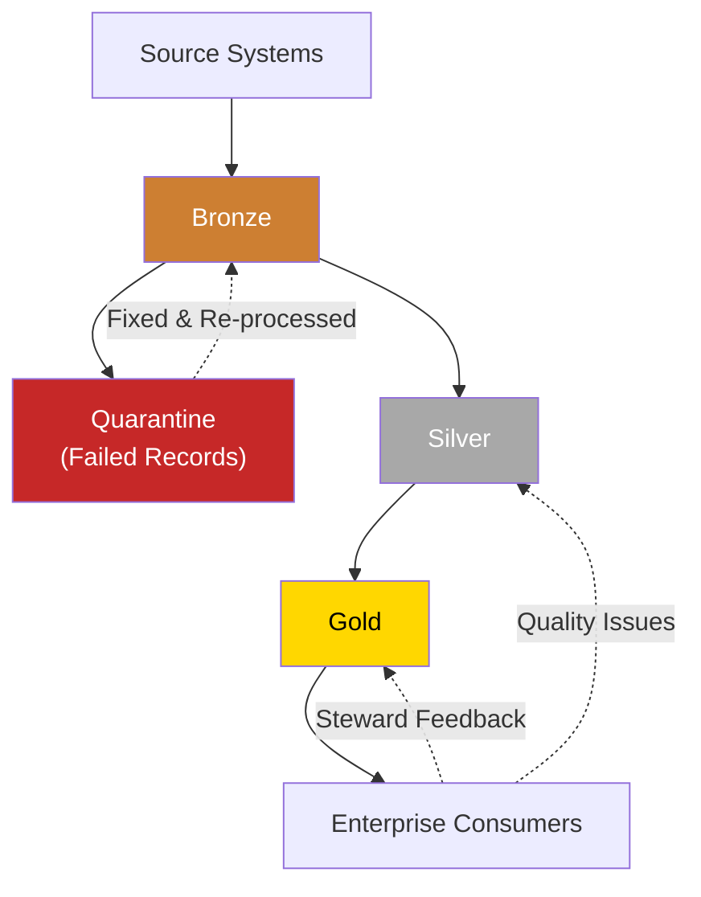

# Medallion Architecture

A deep dive into the Bronze → Silver → Gold data organization pattern and how it maps to the 15-phase entity resolution maturity model.

---

## Overview

The medallion architecture, implemented natively in Microsoft Fabric and popularized by Databricks, organizes data into three progressive layers:

```
Source Systems → Bronze → Silver → Gold → Consumption
```

Each layer increases data quality, structure, and business value while preserving the raw source data for audit and reprocessing.

---

## Bronze Layer: Raw Data

### Purpose

Preserve source data exactly as received. The Bronze layer is the immutable **system of record** for "what the source system actually sent."

### Phase Mapping

| Phase | What Happens |
|-------|-------------|
| Phase 1: Ingestion | Data lands in Bronze with metadata enrichment (timestamp, source, batch) |
| Phase 2: Schema Validation | Validated records continue in Bronze; failures go to quarantine |
| Phase 3: Data Quality | Quality-checked records are promoted to Silver |

### Storage Characteristics

| Attribute | Recommendation |
|-----------|---------------|
| **Format** | Delta Lake, Parquet, or Avro |
| **Partitioning** | By `load_date` (daily ingestion batches) |
| **Compaction** | Weekly — merge small files into larger ones |
| **Retention** | 30–90 days active, then archive to cold storage |
| **Access Control** | Read-only (append by ingestion jobs only) |
| **Schema** | Schema-on-read — minimal enforcement |

### Example Table

```
bronze.customers
├── customer_name: string
├── email: string
├── phone: string
├── address: string
├── load_timestamp: timestamp     ← metadata
├── source_system: string         ← metadata
├── source_file: string           ← metadata
└── batch_id: string              ← metadata
```

---

## Silver Layer: Clean Data

### Purpose

Eliminate bad data, standardize formats, enrich with reference data, and remove duplicates. The Silver layer is the **working area** for data scientists and analysts.

### Phase Mapping

| Phase | What Happens |
|-------|-------------|
| Phase 4: Standardization | Values normalized to canonical formats |
| Phase 5: Enrichment | Reference data joined; records augmented with context |
| Phase 6: Exact Dedup | Identical and key-based duplicates removed |
| Phase 7: Fuzzy Matching | Near-duplicates identified via string distances |
| Phase 8: Blocking | Scalable candidate pair generation |

### Storage Characteristics

| Attribute | Recommendation |
|-----------|---------------|
| **Format** | Delta Lake (required for ACID merges) |
| **Partitioning** | By entity type and processing date |
| **Compaction** | Daily `OPTIMIZE` for dedup and merge operations |
| **Retention** | Until golden records are confirmed (Phase 13), then archive |
| **Access Control** | Read by analysts and Gold pipeline; write by Silver pipeline only |
| **Schema** | Enforced — schema-on-write |

### Example Table

```
silver.customers_standardized
├── customer_id: long (not null)
├── customer_name: string (Title Case)
├── email: string (lowercase, validated)
├── phone: string (E.164 format)
├── address: string (abbreviations expanded)
├── city: string (from enrichment)
├── province: string (from enrichment)
├── country: string (from enrichment)
├── industry: string (from enrichment)
├── data_quality_score: float
├── dedup_batch_id: string
└── standardized_at: timestamp
```

---

## Gold Layer: Business-Ready Data

### Purpose

Deliver trusted, governed, business-ready data to enterprise consumers. The Gold layer contains matched entities, golden records, and stewardship decisions.

### Phase Mapping

| Phase | What Happens |
|-------|-------------|
| Phase 9: Feature Engineering | Feature vectors assembled from Silver pairs |
| Phase 10: ML Matching | Match probabilities predicted by trained models |
| Phase 11: LLM Semantic | Hard cases resolved by LLM reasoning |
| Phase 12: Embeddings | Vector search for semantic similarity |
| Phase 13: Golden Records | Survivorship rules create single entity view |
| Phase 14: Stewardship | Human decisions resolve remaining uncertainty |
| Phase 15: MDM Distribution | Golden records distributed to consumers |

### Storage Characteristics

| Attribute | Recommendation |
|-----------|---------------|
| **Format** | Delta Lake |
| **Partitioning** | By entity type |
| **Compaction** | Daily `OPTIMIZE` + `VACUUM` |
| **Retention** | Permanent (compliance-grade). Time travel for point-in-time queries. |
| **Access Control** | Read by consumers; write by Gold pipeline and stewards |
| **Schema** | Strictly enforced; changes require governance approval |

### Example Table

```
gold.golden_customers
├── entity_id: string (UUID, PK)
├── customer_name: string (survivorship winner)
├── email: string (survivorship winner)
├── phone: string (survivorship winner)
├── address: string (survivorship winner)
├── city: string
├── province: string
├── country: string
├── industry: string
├── source_records: array<struct>  ← traceability
├── match_confidence: float
├── steward_verified: boolean
├── created_at: timestamp
├── updated_at: timestamp
└── version: int
```

---

## Cross-Layer Data Flow



---

## Retention and Lifecycle

| Layer | Active Retention | Archive | Deletion |
|-------|-----------------|---------|----------|
| **Bronze** | 30 days | 1 year (cold storage) | After 1 year |
| **Silver** | 90 days | 2 years | After 2 years |
| **Gold** | Permanent | N/A | Never (compliance) |
| **Quarantine** | 30 days | Never | After resolution + 30 days |

---

## Access Patterns

| Layer | Writers | Readers | Query Pattern |
|-------|---------|---------|---------------|
| **Bronze** | Ingestion jobs only | Validation jobs, audit | Full table scan by batch_id |
| **Silver** | Quality/Standardization jobs | Analysts, data scientists, Gold pipeline | Filter by entity type, date range |
| **Gold** | Matching/Stewardship jobs | APIs, dashboards, CRM, ERP, AI apps | Point lookup by entity_id, search by name |
| **Quarantine** | Validation/Quality jobs | Data owners, source system teams | Filter by failure_reason, source |
